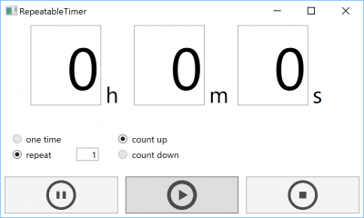

# RepeatableTimer
A timer which can repeat any number of times implemented by WPF.

## Getting started
```cmd
git clone https://github.com/SIkebe/RepeatableTimer.git
cd RepeatableTimer
.\build.ps1 -target ILMerge
.\artifact\RepeatableTimer.exe
```

()